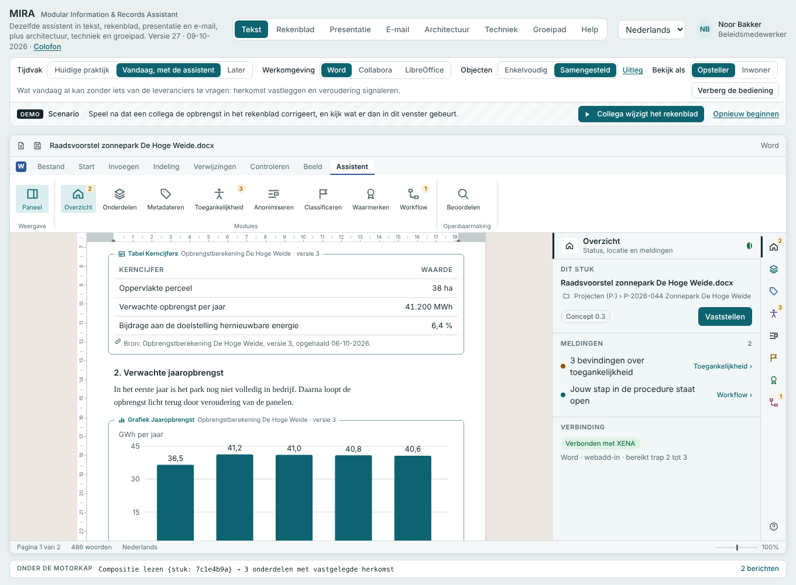

# MIRA

**Modular Information & Records Assistant**, the office assistant of XENA Deel II (*De Office Assistent*).

**English** · [Nederlands](README.nl.md)

An interactive demo of an assistant panel inside office software that takes care of quality at the source: metadata, accessibility, personal data, classification, certification and workflow, for text documents, spreadsheets, presentations and email. The same panel works in different office suites, and nested components (an embedded table, a linked range, an attachment) keep their provenance.



> **A demo, not a product.** All sample data is invented: the people, files and case numbers do not exist. Part of what the demo shows is a future picture; the *Time frame* switch shows what is already possible today.

The demo accompanies *XENA Deel II, De Office Assistent*, the architecture vision it is based on. It is a companion to the demo [Archiefwaardige opslag voor de medewerker](https://github.com/EHa-1999/XENA).

## Try it

Open `index.html` in a browser. It is a single self-contained file: no installation, no build step, no server.

With GitHub Pages enabled for this repository, the demo is also available at `https://<account>.github.io/<repository>/`.

The interface is available in Dutch, German, English and French. The demo opens in Dutch. The language can be changed at the top right, which is remembered; adding `#de`, `#en`, `#fr` or `#nl` to the address selects a language directly.

## What the demo shows

| View | What you see |
|---|---|
| **Text** | A council proposal in the word processor with the assistant panel beside it. The most complete document; start here. |
| **Spreadsheet** | The source of the figures. Save a new version and see under *Used in* which documents are now behind. |
| **Presentation** | Three slides with speaker notes. The panel follows the slide in view. |
| **Email** | A message with two attachments. On sending, the assistant asks one question per attachment. |
| **Architecture** | The four environments, the contract between them, and the steps per action. |
| **Engineering** | Per function what it requires, and from whom: the work environment, the vendor or the platform. |
| **Roadmap** | Adoption in four stages, three of them without waiting for the market. |
| **Help** | The views, a route to try, frequently asked questions and a glossary. |

Three switches apply to the document views: **Time frame** (current practice, today with the assistant, later), **Work environment** (three office suites or mail environments) and **View as** (author, or a resident or recipient). The bar at the bottom, *Under the hood*, shows which call or event belongs to each action.

## Repository layout

| Path | Contents |
|---|---|
| `index.html` | The demo, built and ready to open. |
| `src/demo.html` | The source: styles, markup and script in one file. Dutch is the source language. |
| `i18n/<language>.json` | Translations, keyed by the Dutch text. |
| `i18n/bron.json` | All Dutch texts found in the demo, collected automatically. |
| `i18n/TERMEN.md` | Terminology choices per language, with sources. |
| `build.py` | Builds `index.html` from the source and the translations. |
| `tools/strings.js` | Collects the texts and reports what is missing per language. |
| `VERSION`, `CHANGELOG.md` | The version number and the version history. |

## Building and translating

```
python3 build.py                 # builds index.html; the version comes from VERSION, the date is today
npm install playwright           # once, for the tool below
node tools/strings.js            # collects all Dutch texts into i18n/bron.json
node tools/strings.js de         # lists what is still untranslated in German
```

For a new version: raise the number in `VERSION`, add an entry to `CHANGELOG.md`, run `build.py`.

To add a language, add `i18n/<code>.json` with the Dutch text as key and the translation as value. Languages offered in the menu are those for which a file exists. Numbers in a text are replaced by `{0}`, `{1}` and so on in the key.

## Colophon

Created by Erik Hoekstra, programme architect and senior consultant, i-Ontwikkeling department, Municipality of Haarlem, with assistance from Claude (Anthropic).

Contact: ehoekstra@haarlem.nl · erik@erikhoekstra.com

## Licence

© 2026 Municipality of Haarlem. Free to use, modify and distribute under the [European Union Public Licence (EUPL) 1.2](https://interoperable-europe.ec.europa.eu/collection/eupl/eupl-text-eupl-12). See `LICENSE`.
